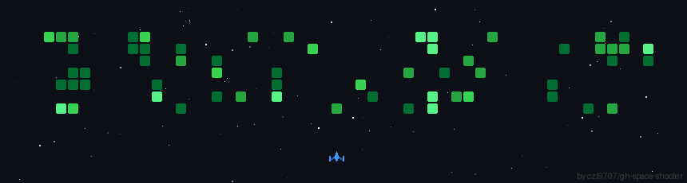

<div align='left'>

```bash
user@github:~$ whoami
Radnyx

user@github:~$ whatis
Full Stack Developer & Competitive Programmer

user@github:~$ cat stack.txt
> Tech Stack: C++, Java, JavaScript, SQL, React, TypeScript, TailwindCSS
> Tools: AWS, VSCode, Git

user@github:~$ echo $GOAL
Solving O(n!) problems in O(n) time
```


<div align="center">

[](https://git.io/typing-svg)


### CONTRIBUTION GRID




<div align="center">


</div>
